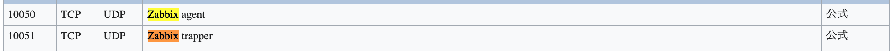
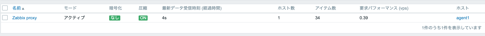
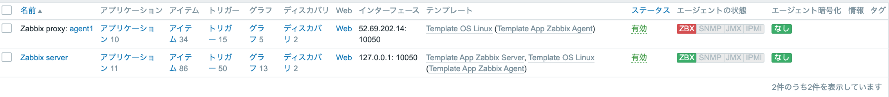
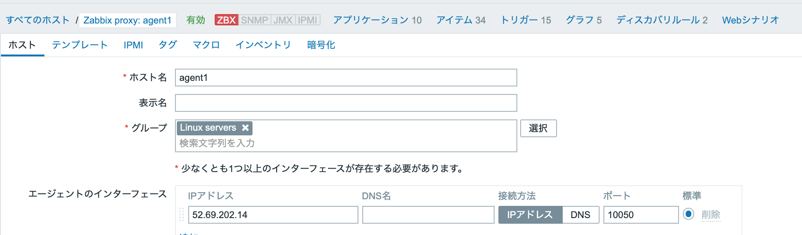

# ISSUE
-----------------------------------------------
# Cannot obtain file information: Permission denied
```
# cat /etc/zabbix/zabbix_agentd.conf | grep AllowRoot
------------------------------
### Option: AllowRoot
AllowRoot=1
------------------------------
```
AllowRoot=1だとセキュリティ的にダメな場合は↓
https://tech-mmmm.blogspot.com/2018/03/zabbixallowroot1varlogmessages.html

# ネットワーク問題...
#### 通信
```
$ curl -vv telnet://<ip>:<port番号>
  サーバー　　　→　プロキシ　　　Failed
  プロキシ　　　→　サーバー　　　OK
  プロキシ　　　→　エージェント　OK
  エージェント　→　プロキシ　　　応答なしbusy

Failed...届いていないのではないか→そもそもサーバーの待ち受け10050指定に問題があるのではないか
busy  ...届いているが問題があるのではないか→セキュリティグループに問題があるのではないか
      ...パケットキャプチャ
```

#### Listen
```
$ sudo lsof -i -n -P
  サーバー      10051
  プロキシ      10051 -> ！？ 10050がlistenされてない。一つのポートしか受け付けないのか？10051で統一
  エージェンント 10050
```


#### も一度通信
```
$ curl -vv telnet://<ip>:<port番号>
  サーバー　　　→　プロキシ　　　OK
  プロキシ　　　→　サーバー　　　OK
  プロキシ　　　→　エージェント　OK
  エージェント　→　プロキシ　　　busy
```

#### ログ
```
$ sudo less /var/log/zabbix/zabbix_server.log
  3465:20200624:132601.346 executing housekeeper
  -> housekeeperが動いて...
  3465:20200624:132601.357 housekeeper [deleted 0 hist/trends, 0 items/triggers, 0 events, 0 problems, 0 sessions, 0 alarms, 0 audit, 0 records in 0.003361 sec, idle for 1 hour(s)]
  -> ログを定期的に削除してるように見える（正常に見える）
  3484:20200624:133246.790 sending configuration data to proxy "Zabbix proxy" at "13.114.165.184", datalen 10114

$ sudo less /var/log/zabbi/zabbix_proxy.log
  4613:20200624:133246.791 proxy #18 started [unreachable poller #1]
  4596:20200624:133246.791 received configuration data from server at "54.199.87.99", datalen 10114
  →　OK
  4623:20200624:133246.806 proxy #24 started [icmp pinger #1]
  4624:20200624:133246.806 proxy #25 started [preprocessing manager #1]
  4626:20200624:133247.007 proxy #27 started [preprocessing worker #2]
  4627:20200624:133247.007 proxy #28 started [preprocessing worker #3]
  4625:20200624:133247.107 proxy #26 started [preprocessing worker #1]
  →　OK?

$ sudo less /var/log/zabbix/zabbix_agentd.log
  active check configuration update from [13.114.165.184:10051] started to fail (cannot connect to [[13.114.165.184]:10051]: [4] Interrupted system call)
  →　インバウンドをセキュリティグループにしてたのを仮でEIPに指定
  no active checks on server [13.114.165.184:10051]: host [Zabbix server] not found
　→　設定ファイルのHostnameを変更

もう一度　$ sudo less /var/log/zabbix/zabbix_agentd.log
  3933:20200624:132644.507 agent #1 started [collector]
  3937:20200624:133244.598 active check configuration update from [13.114.165.184:10051] started to fail (cannot connect to [[13.114.165.184]:10051]: [111] Connection refused)
  3937:20200624:133344.614 active check configuration update from [13.114.165.184:10051] is working again
  →　OK
```
いけたかと思ったが...


### 解決!

```
zabbix_agent.log
active check configuration update from [13.114.165.184:10051] started to fail (cannot connect to [[13.114.165.184]:10051]: [4] Interrupted system call)
-> AgentがProxyに行きたいけど、[[13.114.165.184]:10051]でzabbixが受け付けてないという意味（今回はAWSのセキュリティグループで止まってるわけではなかった。WebでAgent登録時、パブリックIPではなくプライベートIPでの定義をしたから）

プロキシのセキュリティグループ10051でListenをエージェントのプライベートIPに設定

zabbix_agent.log
3556:20200625:095823.717 failed to accept an incoming connection: connection from "10.20.10.10" rejected, allowed hosts: "13.114.165.184"

zabbix_agent.confのServerとActiveServerをProxyのプライベートIPに変更。

zabbix_proxy.log
enabling Zabbix agent checks on host "Zabbix agent": host became available
できた！！！
```
<br>

# Proxyを建てたがAgent情報取得できず...

- 解決！
agent側の/etc/zabbix/zabbix_agentd.confのServer/ActiveServerの値をServerIPからProxyIPに変更！忘れるべからず！
<br>

- 構成


■ Version
    各EC2の各zabbixサービスは、[ver. 4.2.8]　-> OK!

■ Hostname
    プロキシインスタンス/etc/zabbix/zabbix_proxy.conf　Hostname: Zabbix proxy -> OK!

■ 設定
```
# zabbix server [54.64.149.168]
ポート	 プロトコル	  ソース	         myk-zabbix-server-sg
10051	  tcp	       18.180.97.214/32	  ✔


zabbix proxy eip:  18.180.97.214
ポート	 プロトコル	  ソース	          myk-zabbix-proxy-sg
10051	  tcp	       52.69.202.14/32	   ✔
10050	  tcp	       54.64.149.168/32	   ✔


zabbix agent eip:  52.69.202.14
ポート	 プロトコル	  ソース	           myk-zabbix-agent-sg
10050	  tcp	       18.180.97.214/32	   ✔
```
■ ZABBIX WebUIにて
    [管理 > プロキシ]で、経過時間を確認 -> server proxy間は問題ないように見える

    proxyとagentは関連付けできている

    [エージェントのインターフェイス] -> Zabbix-AgentのEIPでいいのだろうか？


■ やったこと
    /etc/zabbix/zabbix_proxy.conf アクティブモードに変更 ProxyMode=0
    zabbix-proxy停止・起動

  　変わらず！

　　SecurityGroupにICMPを足してPing　-> 疎通確認できたけど、デバッグになってない気がするなってない気がする


# MEMO
-----------------------------------------------
エフェメラルポート番号 [1024-65535] もカスタムTCPルールで指定可能

# アラートを確認その２
stressツールを入れるまでもない時
CPU使用率だけあげたいなら...
```
$ yes > /dev/null &
  yes      : 標準出力にyを出し続ける
  /dev/null: 画面表示がない -> 高速でできる
  &        : バックグラウンド

$ top

# Zabbix-serverで確認

$ ps aux | grep yes
$ kill -9 <プロセス番号>
```
