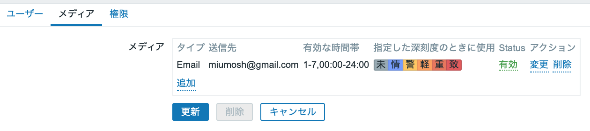
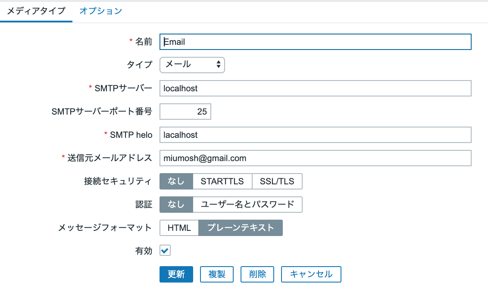
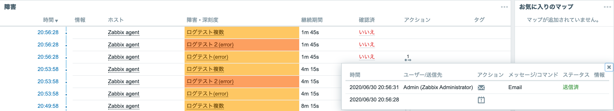
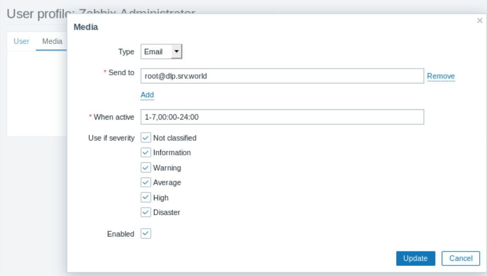
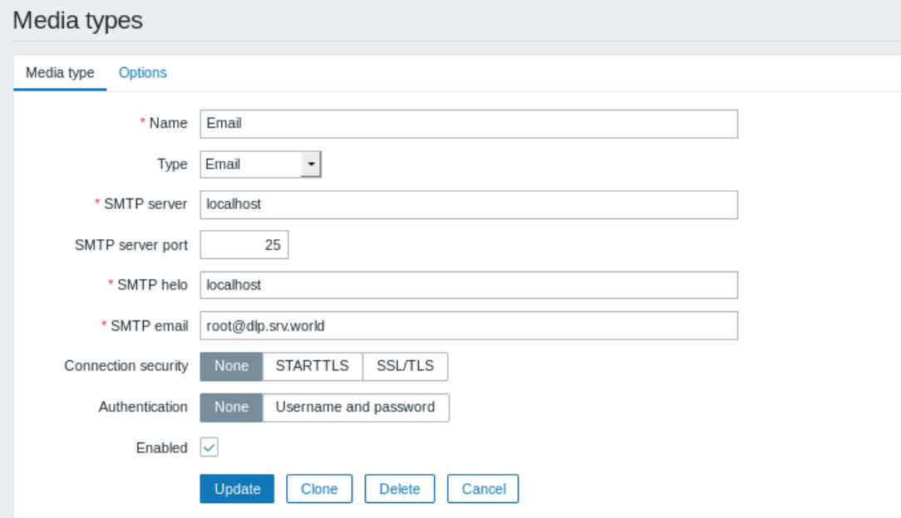

# メール設定
## 事前準備
```
1.  MTAのホスト名を決める
2.  EIPを取得
3.  ホストのAレコードをドメインに登録する
```

## 今回はしないこと
25番ポートの制限解除と逆引きDNSの登録申請

## Route53設定
```
<example.com>

1. Hosted zoneを作成
2. ゾーンの委譲設定
   AWSから出力された4つのネームサーバを、親ゾーンのNSレコードに登録

以下は今回はしない  
   ・SPFレコード
   ・DKIN
   ・MXレコード（optional: 受信もする場合)
```

## postfix設定
```
設定されてるMTA確認
$ alternatives --display mta

postfixのバージョン・設定確認
$ rpm -qa | grep postfix
$ postconf -n

設定ファイルのオリジナルをコピー
$ sudo cp {-a or -p} /etc/postfix/main.cf /etc/postfix/main.cf.org

$ sudo vi /etc/postfix/main.cf
#myhostname = host.domain.tld
#myhostname = virtual.domain.tld
myhostname = mail.example.com
-> Linux 自身のFQDN名を記述する？
   -> メールヘッダーの経路情報やSMTP通信時のEHLOコマンドの返答値に使われる

#mydomain = domain.tld
mydomain = example.com  -> 指定しなくてもいい。myhostnameから最初の要素を引くのがdefault
-> 所属DNSドメインを記述 ※インターネット上で有効なDNSドメインであること

#myorigin = $myhostname -> ~@mail.example.com
myorigin = $mydomain    -> ~@example.com
-> 受信者アドレスがユーザー名だけの場合に自動付与するアドレスを指定

inet_interfaces = all
-> Linuxマシン自身のどのIPアドレスでメールをやり取りするか指定

inet_protcols = all
-> IPv4 と IPv6 ( 指定はipv4, ipv6 )

mydestination = $myhostname, $localhost, $mydomain, localhost, +$mydomain   -> ドメインと一致するメールも自身のボックスに格納する例
-> 指定したアドレスとメールアドレスの[@]から右側と一致したメールは、他メールサーバーに配送せず、
   このLinuxマシン自身が最終受信者としてメールボックスに格納するようになる

mynetworks = 127.0.0.0/8, 172.27.1.0/24   -> 管轄の事業オフィスやデータセンターの内部ネットワークのみを指定
-> 他サーバーまたはクライアントからのSMTP通信を受付許可するネットワークアドレスを指定
-> インターネット上のあらゆるネットワークアドレスを記述してしまうと、第三者中継サーバーとなる為注意

$ sudo postfix check   -> 構文チェック
$ sudo systemctl restart postfix

$ ss -tuan | grep :25   -> 25がListenしているか確認
```

## Zabbix設定
```
1. メディアタイプ: メールサーバー設定
2. ユーザー     : メールアドレス設定
3. アクション   : メール送信設定  
```

#### メディアタイプ(Email)
```
名前
タイプ
SMTPサーバー         : mail.example.com         -> メール送信するSMTPサーバーを設定
SMTPサーバーポート番号 : 25
SMTP helo           : example.com              -> メール送信の際にSMTPサーバーへ送信する送信元ホスト名を指名
送信元メールアドレス   : zabbix@example.com        -> 送信時に利用するFrom名
接続セキュリティ       : なし STARTTLS SSL/TLS
認証                 : なし ユーザー名とパスワード
メッセージフォーマット  : HTML プレーンテキスト
有効
```

## ログ
#### case 1




/var/log/maillog (zabbix web側で問題がなくても、postfix側で問題がある例)
```ruby
Jun 30 20:56:32 ip-10-10-10-10 postfix/smtpd[3959]: connect from localhost[127.0.0.1]
Jun 30 20:56:32 ip-10-10-10-10 postfix/smtpd[3959]: 1EE6634382: client=localhost[127.0.0.1]
Jun 30 20:56:32 ip-10-10-10-10 postfix/cleanup[3962]: 1EE6634382: message-id=<20200630115632.1EE6634382@mail.example.com>
Jun 30 20:56:32 ip-10-10-10-10 postfix/qmgr[3247]: 1EE6634382: from=<miumosh@gmail.com>, size=1448, nrcpt=1 (queue active)
Jun 30 20:56:32 ip-10-10-10-10 postfix/smtpd[3959]: disconnect from localhost[127.0.0.1]
Jun 30 20:57:02 ip-10-10-10-10 postfix/smtp[3963]: connect to gmail-smtp-in.l.google.com[64.233.187.26]:25: Connection timed out
Jun 30 20:57:02 ip-10-10-10-10 postfix/smtp[3963]: connect to gmail-smtp-in.l.google.com[2404:6800:4008:c03::1b]:25: Network is unreachable
Jun 30 20:57:02 ip-10-10-10-10 postfix/smtp[3963]: connect to alt1.gmail-smtp-in.l.google.com[2607:f8b0:4003:c0f::1b]:25: Network is unreachable
Jun 30 20:57:32 ip-10-10-10-10 postfix/smtp[3963]: connect to alt1.gmail-smtp-in.l.google.com[173.194.70.27]:25: Connection timed out
Jun 30 20:57:32 ip-10-10-10-10 postfix/smtp[3963]: connect to alt2.gmail-smtp-in.l.google.com[2607:f8b0:4001:c1f::1b]:25: Network is unreachable
Jun 30 20:57:32 ip-10-10-10-10 postfix/smtp[3963]: 1EE6634382: to=<miumosh@gmail.com>, relay=none, delay=60, delays=0.01/0.01/60/0, dsn=4.4.1, status=deferred (connect to alt2.gmail-smtp-in.l.google.com[2607:f8b0:4001:c1f::1b]:25: Network is unreachable)
```
/etc/httpd/conf/httpd.conf が以下の値だからかな...
```ruby
ServerAdmin root@localhost
#ServerName www.example.com:80
```

#### case2


/etc/httpd/conf/httpd.conf
```ruby
ServerAdmin root@srv.world
```
/var/log/maillog
```ruby
Jun 30 22:32:02 ip-10-10-10-10 postfix/smtpd[5129]: connect from localhost[127.0.0.1]
Jun 30 22:32:02 ip-10-10-10-10 postfix/smtpd[5129]: AFD1F84504: client=localhost[127.0.0.1]
Jun 30 22:32:02 ip-10-10-10-10 postfix/cleanup[5132]: AFD1F84504: message-id=<20200630133202.AFD1F84504@mail.example.com>
Jun 30 22:32:02 ip-10-10-10-10 postfix/qmgr[3247]: AFD1F84504: from=<root@dlp.srv.world>, size=1503, nrcpt=1 (queue active)
Jun 30 22:32:02 ip-10-10-10-10 postfix/smtpd[5129]: disconnect from localhost[127.0.0.1]
Jun 30 22:32:33 ip-10-10-10-10 postfix/smtp[5133]: connect to dlp.srv.world[180.43.145.38]:25: Connection timed out
Jun 30 22:32:33 ip-10-10-10-10 postfix/smtp[5133]: AFD1F84504: to=<root@dlp.srv.world>, relay=none, delay=30, delays=0.01/0.01/30/0, dsn=4.4.1, status=deferred (connect to dlp.srv.world[180.43.145.38]:25: Connection timed out)
```


# httpd 設定ファイル
/etc/httpd/conf/httpd.conf
```
# zabbix web Email config [Media Type/SMTP Email:] -> 送信者From
ServerAdmin root@localhost

# 
#ServerName www.example.com:80
```

# 参考
https://www.rem-system.com/mail-postfix01/

postfix チュートリアル
http://www.tmtm.org/postfix/tutorial/index.html

★
https://www.walbrix.co.jp/blog/2014-02-zabbix-simple-web-monitoring.html