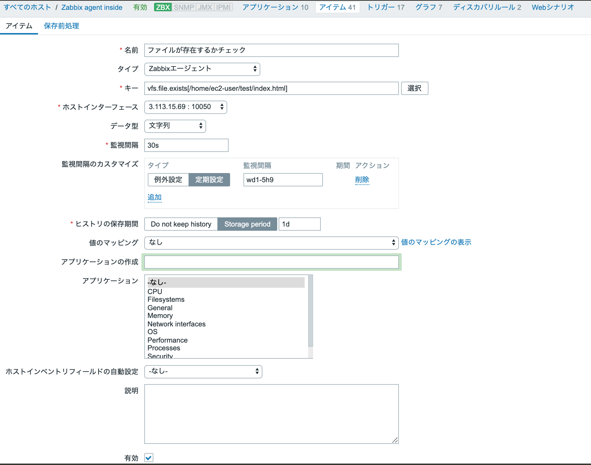

---------------------------------------------------------
# MSP
---------------------------------------------------------
監視項目例
```
死活監視
リソース監視（CPU、ロードアベレージ、メモリ、ディスク使用率など）
プロセス監視（sshd、zabbix-agent、ミドルなど）
ポート監視（sshd、zabbix-agent、ミドルなど）
ログ監視（たとえば、mysqlのログとか）

その他
時刻同期ができているかの監視
mysqlのレプリケーション監視
webの外形監視

トリガーは、
値がいくつ以上といった単純なものから、
何分間に何回以上ログにErrorが含まれている場合とか、
ログの出力が何分間なかった場合や、
CPUとロードアベレージが共に閾値以上の場合に発報
```
---------------------------------------------------------
# Variable
---------------------------------------------------------
https://www.zabbix.com/documentation/2.2/jp/manual/appendix/macros/supported_by_location

ex
```
# 条件式の中の環境変数
trigger name              : {TRIGGER.NAME}
trigger status            : {TRIGGER.STATUS}

hostname                  : {HOSTNAME}
path of error log         : {TRIGGER.KEY}
error count nearly a hour : {{HOSTNAME}: {TRIGGER.KEY}.count(1h,"WARNING")}

Event ID                  : {EVENT.ID}
Trigger                   : {TRIGGER.NAME}
Trigger status            : {TRRIGER.STATUS}
Trigger severity          : {TRIGGER.SEVERITY}
Trigger URL               : {TRIGGER.URL}

latest log                : {{HOSTNAME}:{TRIGGER.KEY}.last(#1)}
                            {{HOSTNAME}:{TRIGGER.KEY}.last(#n行目)}
                            ...
                            ※↓は誤って検知されることがあるらしいので↑を使用
                            1. {ITEM.NAME1} ({HOST.NAME1}:{ITEM.KEY1}): {ITEM.VALUE1}
                            2. {ITEM.NAME2} ({HOST.NAME2}:{ITEM.KEY2}): {ITEM.VALUE2}

```
---------------------------------------------------------
# 監視間隔カスタマイズ
---------------------------------------------------------
```
md：日１〜３１
wd：曜日１〜７
h：０〜２３
s：０〜５９

/：繰り返し
;：複数設定指定の区切り
,：複数時刻指定の区切り

> 月曜ー金曜はデータ収集しない。土日は1時間間隔で監視
・監視間隔：0
・例外設定の監視間隔：1h
・例外設定の期間：6-7,00:00-24:00

> 月曜ー金曜は5分間隔でデータ収集。土日は1時間間隔でデータ収集。
・監視間隔：５
・例外設定の監視間隔：１h
・例外設定の期間：6-7,00:00-24:00

> 通常5分間隔。月曜ー金曜は午前9時に監視実行
・監視間隔：5m
・定期設定の監視間隔：wd1-5h9

> 毎日９−18時の間で毎時０分ちょうどのタイミングで監視実行
・監視間隔：0
・定期設定の監視間隔：h９−１８
```
---------------------------------------------------------
# 取得できる情報を調べる
---------------------------------------------------------

zabbix_get
```
$ yum -y install zabbix-get
$ zabbix_get -h

$ zabbix_get -s 192.168.0.101 -k system.hostname
$ zabbix_get -s 192.168.0.45 -k proc.num[httpd]
$ zabbix_get -s 10.0.20.20 -k net.tcp.port[,80]
```
https://www.zabbix.com/documentation/2.0/jp/manual/concepts/get

---------------------------------------------------------
# トリガー
---------------------------------------------------------
```
トリガー条件式は、{＜テンプレート名＞:＜アイテムキー＞.＜トリガー関数＞}=＜値＞
{<「ホスト」の名前>:<「アイテム」のキー>.last()}>5 
{sample_host:system.cpu.load.last()}>5  
```
---------------------------------------------------------
# アクション
---------------------------------------------------------
アクション設定：https://tech-lab.sios.jp/archives/12604
zabbix_gmail設定：http://unam.hatenadiary.jp/entry/2018/01/14/132911
gmail設定：https://myaccount.google.com/lesssecureapps
参考：https://go-journey.club/archives/5414

---------------------------------------------------------
# 外部チェック
---------------------------------------------------------
参考：https://go-journey.club/archives/5180

---------------------------------------------------------
# ログ監視
---------------------------------------------------------
```
1. 直接指定
アイテムのキーに直接入力
()はエスケープする必要があるので\をつける(例えば(INFO)という文字列ヒットを狙う)
ex) log[/tmp/logfile,ERROR|WARN]
ex) log[/tmp/logfile,"\(INFO\)"]
キーに直接正規表現を記述する際、正規表現を"（ダブルクオーテーション）"で囲んでも囲まなくても、結果は同じ

ex) log[/tmp/logfile,@Log_Exp] -> 正規表現の頭に@をつけてグローバル正規表現を指定

2. ユーザーマクロ
テンプレートなどでログ監視アイテムを作成する場合、利用するホストによって監視対象文字列を変更する可能性もあるため、マクロにしておいたほうが変更・管理がしやすくなる。

マクロで正規表現を指定する場合は、ダブルクォーテーションで囲んではいけない
マクロ{$LOF_EXP1}   =   値"\(INFO\)" -> NG!それ自体がエスケープされる
値に@をつけてグローバル正規表現を使うこともできる

3. グローバル正規表現
管理→一般設定→正規表現→正規表現の作成
正規表現の名前と条件式（ややこしいがこの欄で()をエスケープする必要はない）を記述

グローバル正規表現を使ってログの検索対象を指定することができる。
ただ、ホストやテンプレートのエクスポート/インポートの対象に含まれていないため、
設定を他のサーバに移す際に少し面倒。

# 6. 注意点
### ホストのマクロ
OSによってシステムログのパスが違うのでホストのマクロに登録する
{$SYSLOG} = /var/log/messages

### アイテムのキー値
ログに出力された内容は全てサーバーに収集する。アイテムはテンプレートの中に作ること
logrt[{$SYSLOG}]

### 正規表現
検知したい文字列と検知したい文字列を含んでしまうけど除外したい文字列を正規表現に定義
syslog_regexp = err | warn | fail | panic 結果を真　大文字小文字を区別
syslog_exclude = test 結果を真　大文字小文字を区別

### トリガー条件式
検知文字列を受信した場合のトリガーと、除外文字列を受信したときのトリガーを”＆”でくくる
ログ監視は自動的に正常に戻らないので基準時間(5分)を決めておき定期的に障害状態を解除する条件も追加する
{hostname:logrt[{$SYSLOG}].regexp(@syslog_regexp)}=1
&
{hostname:logrt[{$SYSLOG}].regexp(@syslog_exclude)}=0
&
{hostname:logrt[{$SYSLOG}].nodata(300)}=0

{Zabbix agent}
```
```
アイテムの
タイプ
zabbixエージェント（アクティブ）
キー
log[/var/log/zabbix/zabbix_test.log,,,,skip]

設定＞ホスト＞アイテム＞取得不可！（Accessible only as active check.）
```
---------------------------------------------------------
# Question
---------------------------------------------------------
プロキシはデフォルトの「Mode=0」でアクティブいう認識なのですが
エージェントのアクティブ、パッシブは「ActiveServer=...」の値で決まるという認識で合ってるでしょうか？


---------------------------------------------------------
# Preference
---------------------------------------------------------
エラーモニタリング　ログ監視Qiita
https://qiita.com/nyanchu/items/5b6fd12046df21104f69


