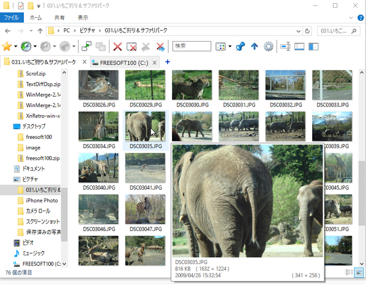
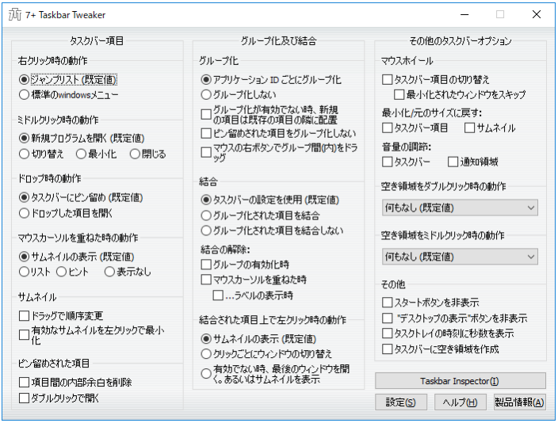
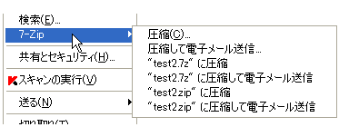

# PC
- Vaio
- Windows 10 pro 2020/07/01
- WSL Ubuntu 18.04 LTS

# WSL
- 次回はこうしたいという願望
```
・WSL2導入
・zsh, peco, tmux, vim, git, awscli設定
・VartualBox, Vagrant...etcもWSL側で設定
```

# VirtualBox
VirtualBox-6.1.10-138449-Win.exe
※ Hyper V: off -> Docker for Windows: off
#### VirtualChecker
https://forest.watch.impress.co.jp/library/software/virtualcheck/

# Vagrant
vagrant_2.2.9_x86_64.msi

※ PATHに日本語が入った時
```
- 考察
１、vagrant init をするディレクトリへのパス
２、vagrant upした際に参照するboxイメージへのパス（default: C/Users/ユーザー名/.vagrant.d）
３、vagrant upして出来上がったデータが置かれる場所（default: C/Users/ユーザー名/VirtualBox VMs）
- 対処 
１に関してはC直下にディレクトリを作成する
２に関しては環境変数VAGRANT_HOMEをC直下のパスに設定する
３に関しては恐らく影響はない
```
※ WSLとWindows
```
windows: c/HashiCorp/.vagrant.d
wsl    : c/HashiCorp/.vagrant.wsl.d
```
# Git
Git-2.27.0-64-bit.exe

# AWSCLI
AWSCLIV2.msi

# Process Explorer
https://docs.microsoft.com/en-us/sysinternals/downloads/process-explorer
https://www.atmarkit.co.jp/ait/articles/1407/23/news030.html

# Ctrl2Cap
CapsLock → Ctrl
https://www.atmarkit.co.jp/ait/articles/0907/03/news103.html

# ChangeKey
Ctrl → CapsLock
https://forest.watch.impress.co.jp/library/software/changekey/

# QTTabBar
https://freesoft-100.com/review/qttabbar.php


# 7+ Taskbar Tweaker
7+ Taskbar Tweaker v5.9
https://forest.watch.impress.co.jp/library/software/7taskb_tweak/
https://www.japan-secure.com/entry/blog-entry-314.html


# 7ZIP
7z1900-x64.exe
https://ja.osdn.net/projects/sevenzip/
